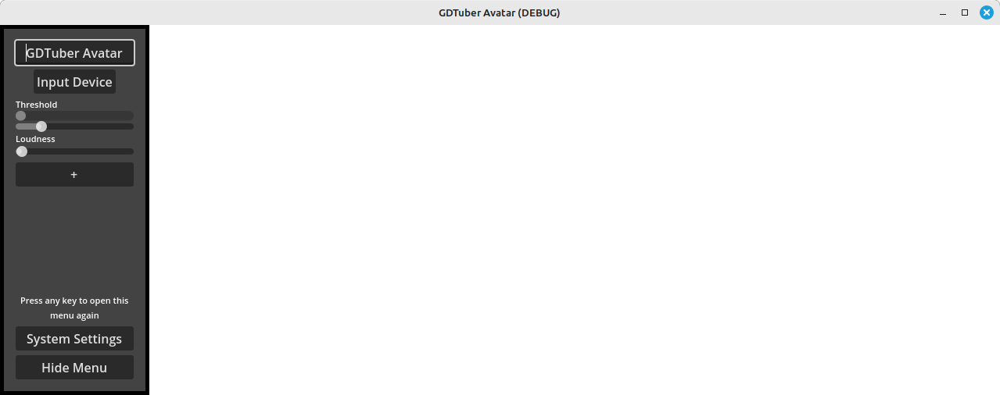
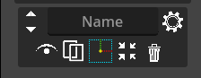
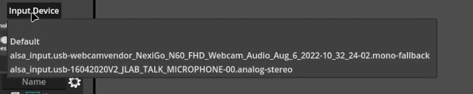
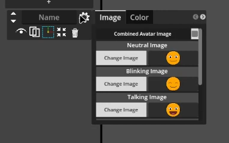
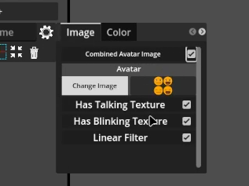

# Quick Setup

 1. Upon first time Opening GDTube you should see a window with a Transparent Background and an menu bar on the left side of the window. The menu bar contains the following items from top to bottom: 
     
    
    - Scene Title: Editable textbox for giving your scene a name.
    - Input device options drop down: A button that will show a drop down of available input devices. 
    - Threshold/Input Volume Visual and Slider: Will show your threshold for activation of animation, and slider for adjusting tolerance of threshold
    - Loudness: Slider for adjusting input gain
    - \+  (Create New Screen Object): Adds new visual element to scene 
    - System Settings: Opens System Settings menu 
    - Hide Menu: Hides side bar from visibility, pressing any key in the window will make the menu reappear. 

2. Press the `+` button to create a new avatar/scene element. The system default will appear automatically in the center of the screen and in the menu bar a `Screen Object Element` menu will appear. Keep pressing the + to add more element instances to the scene. The `Screen Object Element` has the following menu options from right to left.
        
     
    - Up and Down toggle for Scenes Z order. 
    - Element Name label for naming the visual element.
    - Settings Button (Gear Icon): Image source configurations and options including color minuplation settings. 
    - Visibility Button (Eyeball Icon): Toggle for making element visible and non-visible
    - Duplicate Button: Creates new duplicate the Screen Object Element.
    - Gizmo Icon: Allows for transform, resize and rotation of Screen Object Element. 
    - Delete (Trash can): Removes Screen Object Element.  

3. Select your microphone by clicking the `Input Device` and selecting your preferred device from the drop down menu choices 
        
     

4. Click the Gear Icon to open the image Screen Object Element settings pop up menu to upload your own custom avatar or images (for more information see the **[Image Setup](#image-setup)** section)
        
     
5. Clicking the Gizmo Icon allows for `Screen Object Element` transformations of the image as follows: 
    - left click to move the object on screen
    - right click to rotate the object on screen
    - scroll wheel to scale the selected object on screen

## Image Setup

Currently GDTube Supports four kinds of state for an image/avatar: **Neutral**, **Blinking**, **Talking**, **Talking + Blinking**

Currently GDTube supports two ways of setting images to state, [Single Image](#single-image) mode where each state is set to single image file and [Multiple Images](#multiple-images) mode where states are contained on a single image sprite sheet. 

Any image formats supported by Godot should work in GDTube (For a list of supported image formats see Godot Docs [here](https://docs.godotengine.org/en/stable/tutorials/assets_pipeline/importing_images.html))

### Image Control Options

#### Enabling/Disabling States

Both Single and Multiple image modes support disabling/enabling any of the avatar states (**Neutral**, **Blinking**, **Talking**, **Talking + Blinking**) by checking/unchecking them from the options at the bottom the image tab menu. 

#### Pixel Art

If you have pixel art or a low res image as your avatar go under the sprite settings and image then uncheck linear filter, the linear filter makes that fuss in the pixel art.

    
 

### Single Image

Allows you to set your avatar states via individual image files to a state. 

To use this mode uncheck the *Combined Avatar Image* Option. 

#### Single Image Setup 

1. After adding a `Screen Object Element` click the Settings Button (Gear Icon) to open the image configuration options. This should give you a menu with image state options and buttons stating `Change Image`. 

2. Clicking the change Image button for any of the states will open your systems file explorer for you to select the image you want to use. 

3. Navigate and select the image file and it should appear for that state.
    
 

### Multiple Images

Allows you to set your avatar states via single image sprite sheet file. 

To use this mode check the *Combined Avatar Image* Option.

#### Multiple Image Setup 

##### Multiple Image Sprite Sheet Requirements 

To show up correctly your sprite sheet must be a 1:1 ratio image taking up an even quadrant of the image for each state.  Top left will be the  **Neutral** state, top right will be that **Talking** state, bottom left will be the **Blinking State**, bottom right will be the **Talking + Blinking** state. 

    
 

1. After adding a `Screen Object Element` click the Settings Button (Gear Icon) to open the image configuration options. Make sure *Combined Avatar Image* Option is checked. 
    
 

2. Click the Change Image button to open your systems file explorer. 

3. Navigate and select the sprite sheet image file you'd like to use for the predefined avatar states. You should now see your sprite sheet being used for all states that are enabled. 

## OBS Integration Recommendation

1. Create New or Load a scene in OBS
2. Under sources click the add button and choose window capture
3. Create a new capture source and give it a name "GDTuber" window
4. Under the window options look for the GDTuber window 
5. Adjust windows settings such as crop, to preference 
4. Click ok