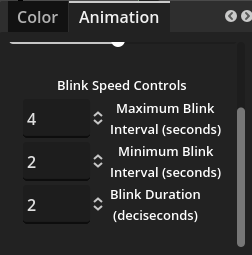

# Configuration Options

## Animation

### Blink Speed Controls

 

GDTuber Blink Speed Controls allows the user to set a randomized time interval between blink animation in seconds and how long the blink animation should last. 

The interval at each blink cycle is a random number from the Minimum Blink Interval and the Maximum Blink Interval set in seconds.  

Blink duration is in tenths of a second(deciseconds) how long the blink frames will be displayed as part of the blink animation cycle. 

