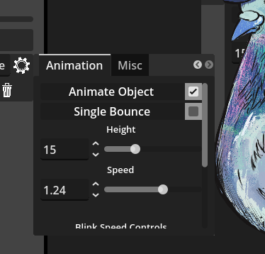

# Configuration Options

## Color Controls 

Options for modifying the Hue, Saturation and Lightness(Value) of the image object. 

## Animation

 

### Animate Object

Check box that controls if the screen object should bounce up and down. 

### Single Bounce 

Check box that when the [Animate Object](#Animate-Object) checkbox is enabled, screen object will bounce once per voice activity detection. Single Bounce is disabled when [Animate Object](#Animate-Object) is disabled

### Animate Object 

Controls the up and down range of the bounce animation. 

### Speed 

Controls how fast the bounce animation goes. 

### Blink Speed Controls

 

GDTuber Blink Speed Controls allows the user to set a randomized time interval between blink animation in seconds and how long the blink animation should last. 

The interval at each blink cycle is a random number from the Minimum Blink Interval and the Maximum Blink Interval set in seconds.  

Blink duration is in tenths of a second(deciseconds) how long the blink frames will be displayed as part of the blink animation cycle. 

